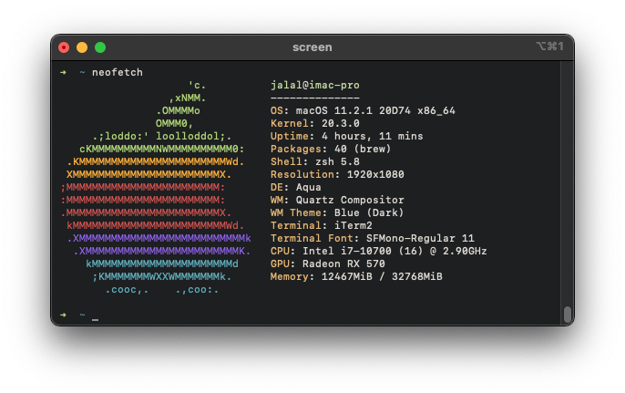

# ASUS ROG Strix B460-i

## Hardware

- **Motherboard:** Asus ROG Strix B460-I
  * Ethernet: Intel® i219-V 1Gb Ethernet
  * Audio Codec: Realtek ALCS1220A (Layout 7)
  * Wireless: Intel® Wi-Fi 6 AX200
  
- **CPU:** Intel Core i7 10700
- **dGPU:** Sapphire RX 570 ITX 8GB
- **RAM:** Corsair Vengeance LPX 32GB 2x16GB DDR4 2666Mhz
- **Storage:** Adata XPG SX8200 PRO 512GB M.2 NVMe
- **WiFi & Bluetooth:** BCM94360CS2 + NGFF M.2 Adapter
- **Monitor:** Dell P2319H

## Software

- **OS:** MacOS Catalina 10.15.5 (Updated to 10.15.6)
- **Bootloader:** OpenCore 0.5.9

## BIOS Settings

**Disabled:**
- Fast Boot
- VT-d
- CSM
- Intel SGX
- CFG Lock (No option in BIOS, Asus B460 motherboards are factory unlocked)

**Enabled:**
- VT-x
- Above 4G decoding
- Hyper-Threading
- Execute Disable Bit
- EHCI/XHCI Hand-off
- OS type: Windows 8.1/10 UEFI Mode
- DVMT Pre-Allocated (iGPU Memory): 64MB

## What's working

- [x] Intel UHD630 (iGPU)
- [x] Sapphire RX 570 ITX (dGPU)
- [x] Restart/Shutdown
- [x] Sleep/Wake
- [x] Power Management (Native support)
- [x] WiFi & Bluetooth (BCM94360CS2)
- [x] USB

## Issues
### USB
This board usb device id is `0xa3af` which is not supported by default in `USBInjectAll.kext` and `XHCI-unsupported.kext`, hence rename is required in both kext `0xa2af` > `0xa3af`.

### Color banding
I came across this issue with this build even though I didn't get this issue with my [previous build](https://github.com/jalalabdulaziz/Gigabyte-B360N) using the same monitor. Solution: EDID injection using Hackintool via kext `Display-10ac-d0d7.kext` + SwitchResX app, change setting from `Billions of colors` to `Millions of colors`

### BIOS POSTed in safe mode
As explained [here](https://dortania.github.io/OpenCore-Post-Install/misc/rtc.html#finding-our-bad-rtc-region), the solution to use the boot-arg `rtcfx_exclude=00-FF`

## Guides & Useful Links

- [OpenCore Vanilla Desktop Guide](https://dortania.github.io/OpenCore-Install-Guide/)

## To Dos

- [x] Proper USB Mapping
- [x] Fix color banding